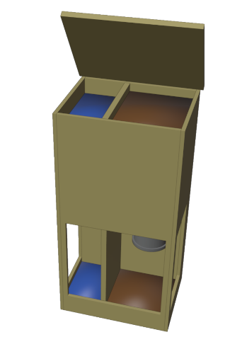
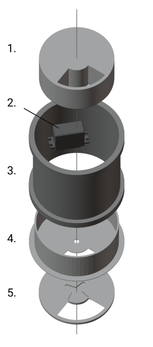

# Chickpi

A chicken coop robot that opens/closes the door, and provides food and water powered by a RaspberryPi. It runs a simple python script in the background checking a schedule every 60 seconds if it needs to do something.

## Components



### Feeder
The feeder is a pipe with a protected servo motor that allows grain to fall through when the motor rotates the turntable in position where the cutouts overlap.

1. Servo cover. STL file can be found in 3dmodels folder.
2. MG996R micro digital servo motor.
3. DN110 pipe
4. DN110 Ending with drillhole and cutout
5. Turntable. STL file can be found in 3dmodels folder.


### Door

The door is pulled up and let down by a string that wraps around the spool attached to the Nema17 stepmotor. Height can be set in config.

### Water
I used a recycled float valve from a toilet tank. No fancy tech here.


## Setup
Edit the config file according to your needs. Here is an example that works for my dads 8 Chickens.

```
opening_time: "09:30"
closing_time: "21:00"
door_open_height_in_mm: 400
feeding_factor: 0.4 # Time in seconds during which grain falls through the feeder.
feeding_times:
  - "09:00"
  - "20:40"
```

Install libraries:

```
  pip install schedule pyyaml pathlib
```

The `mg996r_servo.py` and `nema17_stepmotor.py` files contain variables which correspond to the GPIO pins on your Raspberry. Unless you are using the same pins and hardware you will have to edit those.

To have it start up automatically in case of electricity outage or other problems you can add it to crontab.
```
sudo crontab -e
```
Add in a new line:
```
@reboot python3 /home/pi/path/to/Chickpi/chickpi.py &
```
